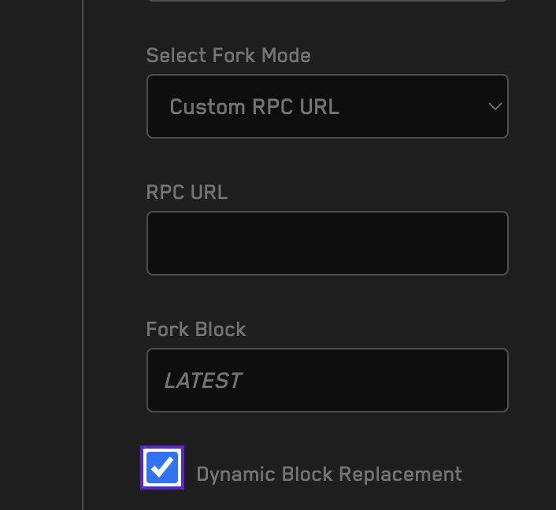
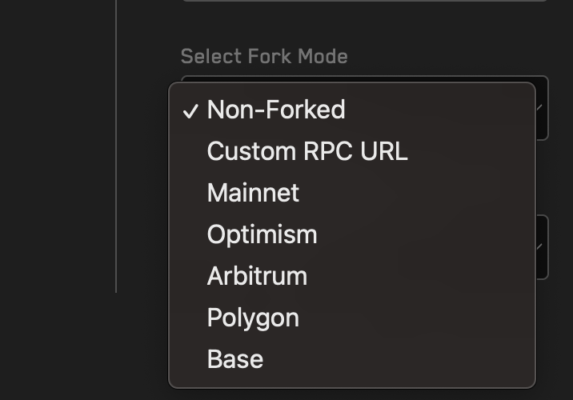
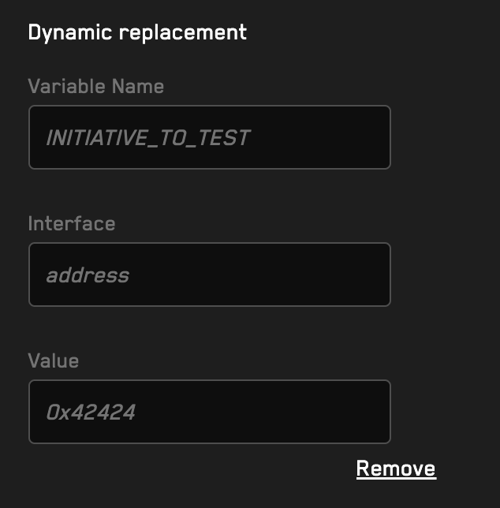

# Liquity Governance Fuzzing

A Recon template to write and test Initiatives to be added to Liquity's governance

This template can also be used for ongoing monitoring, helping Governance flag malicious or incorrectly written initiatives

Giving more information to voters

## Developing

To write your `Initiative` just edit `src/Initiative.sol`

To test it run `Medusa` and `Foundry`

To test it after deployment, run `Echidna` in fork Mode

## Testing

Local Testing

### Run Foundry Tests

```
forge test
```

### Run Medusa Invariant Tests

```
medusa fuzz
```

### Run Echidna Invariant Tests

```
echidna . --contract CryticTester --config echidna.yaml
```

### ADVANCED: Run Echidna Fork Invariant Tests


```
ECHIDNA_RPC_URL=YOUR_URL ECHIDNA_RPC_BLOCK=BLOCK echidna . --contract CryticForkTester --config echidna.yaml
```


## Setup

To write your `Initiative` just edit `src/Initiative.sol`

To test it run `Medusa` and `Foundry`

To test it after deployment, run `Echidna` in fork Mode

## Using Recon Pro

## Run a Fork Test on Recon Pro

Create a Job with Dynamic Replacement

Paste the Repo GH Url

Select Echidna

Toggle Fork Mode, either pick one pre setup chain or paste your RPC URL



Toggle Dynamic Block Replacement so that we'll run your fork test against the latest available block




To test against a specific Initiative setup dynamic replacement as follows:
- Variable Name: INITIATIVE_TO_TEST
- Interface: address
- Value: address to thes (e.g. 0x1231231233)



## Governance Fuzzing and Ongoing Monitorign

Talk to us to setup automated Gov Fuzzing Runs whenever a new initiative is deployed

## Implemented Tests

Testing is unable to magically determine if an initiative is safe or unsafe

We can only verify certain properties

Setup:
- Governance and Bold are correctly set to the intended values

Specifically, we verify that:
- ACCESS CONTROL - Each initiative hook will revert when called by any address that is not the governance
- CALLBACK LOGIC - Each initiative hook will not revert when called

## Recommendations

We recommend running this against each deployed initiative

Recon will set this up as a demo and is open to maintaining the code and offering live alerts to the Liquity Governance Ecosystem

## Help

Read more about our work and DM us on Twitter or Discord

https://getrecon.xyz/
